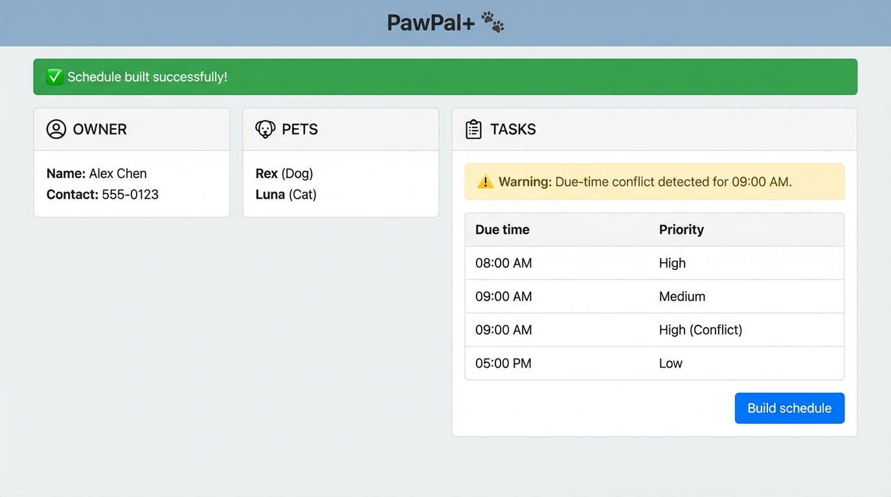

# PawPal+ (Module 2 Project)

**PawPal+** is a small Streamlit app that helps a pet owner plan care tasks using a clear domain model (`Owner` → `Pet` → `Task`) and a **`Scheduler`** for ordering, conflict checks, and a printable day plan.

## Features

- **Owner and pets** — Store the owner’s name and minutes available today; register multiple pets.
- **Tasks** — Add tasks with duration, priority (low / medium / high), optional **due time** (`HH:MM`), and optional **daily** or **weekly** recurrence.
- **Sorting by time** — Pending tasks are listed in **chronological order** via `Scheduler.sort_tasks_by_time` (tasks without a time sort last).
- **Conflict warnings** — `Scheduler.find_due_time_conflicts` flags when two or more pending tasks share the same due time, with copy aimed at pet owners (stagger times or finish one first).
- **Daily / weekly recurrence** — Marking a recurring task complete uses `Pet.finalize_recurring_task` so the next occurrence appears on the following day or week.
- **Build schedule** — `Scheduler.build_plan` fits pending work into the time budget from a chosen day start, with explanations per block and warnings for due-time clashes and internal overlaps.

## Scenario

A busy pet owner needs help staying consistent with pet care. They want an assistant that can:

- Track pet care tasks (walks, feeding, meds, enrichment, grooming, etc.)
- Consider constraints (time available, priority, owner preferences)
- Produce a daily plan and explain why it chose that plan

Your job is to design the system first (UML), then implement the logic in Python, then connect it to the Streamlit UI.

## What you will build

Your final app should:

- Let a user enter basic owner + pet info
- Let a user add/edit tasks (duration + priority at minimum)
- Generate a daily schedule/plan based on constraints and priorities
- Display the plan clearly (and ideally explain the reasoning)
- Include tests for the most important scheduling behaviors

## Getting started

### Setup

```bash
python -m venv .venv
source .venv/bin/activate  # Windows: .venv\Scripts\activate
pip install -r requirements.txt
```

### Suggested workflow

1. Read the scenario carefully and identify requirements and edge cases.
2. Draft a UML diagram (classes, attributes, methods, relationships).
3. Convert UML into Python class stubs (no logic yet).
4. Implement scheduling logic in small increments.
5. Add tests to verify key behaviors.
6. Connect your logic to the Streamlit UI in `app.py`.
7. Refine UML so it matches what you actually built.

### Run the app

```bash
streamlit run app.py
```

Use the command above. Running `python app.py` does not start Streamlit’s server (you would see “missing ScriptRunContext” warnings); the app exits with a short reminder to use `streamlit run`.

## Testing PawPal+

Run the automated tests from the project root:

```bash
python -m pytest
```

The suite covers core behaviors: task completion and pet task lists, **`Scheduler.sort_tasks_by_time`** (chronological order by `due_time`), **`Pet.finalize_recurring_task`** for daily recurrence (next instance on the following day), and **`Scheduler.find_due_time_conflicts`** when two pending tasks share the same due time.

**Confidence level:** ★★★★☆ (4/5) — the tested paths behave as expected; more cases (weekly recurrence, empty task lists, plan overlap warnings) would raise confidence further.

## Architecture snapshot

The final class relationships match `pawpal_system.py` and are summarized in **`uml_final.png`** at the repo root (export of the same structure as the Mermaid diagram in `reflection.md`).

## Demo



If your course site expects assets under a fixed path, use the same image with the LMS-provided URL pattern, for example:

`<a href="/course_images/ai110/pawpal_demo.png" target="_blank"></a>`
