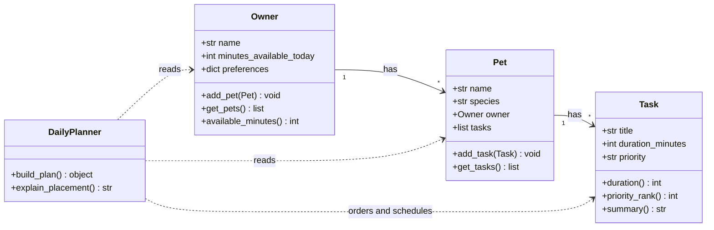

# PawPal+ Project Reflection

## 1. System Design

### Step 2: Building blocks (four main classes)

**Owner**

- **Attributes:** `name`; `minutes_available_today` (how many minutes the owner can spend on pet care today); optional `preferences` (e.g. preferred walk times or simple flags).
- **Methods:** `add_pet(pet)`; `pets()` / `get_pets()`; `available_minutes()` (read or update the time budget).

**Pet**

- **Attributes:** `name`; `species` (e.g. dog, cat, other); reference to owning **Owner**; a collection of **Task** objects for this planning session.
- **Methods:** `add_task(task)`; `tasks()` / `get_tasks()`; optionally `remove_task(task)` for the UI.

**Task**

- **Attributes:** `title`; `duration_minutes`; `priority` (e.g. low / medium / high, matching the Streamlit inputs in `app.py`).
- **Methods:** `duration()` (accessor); `priority_rank()` (numeric rank for sorting); `__repr__` or `summary()` for display.

**DailyPlanner**

- **Attributes:** none required if it is a **stateless** service; optional `day_start` / slot size if you model a clock explicitly later.
- **Methods:** `build_plan(owner, pet, tasks)` → returns an ordered plan (and per-item explanations); `explain_placement(task, context)` for the “why this task here” strings.

Together, this gives: **Owner has many Pets**, **Pet has many Tasks**, and **DailyPlanner** uses Owner + Pet + Tasks to produce the day’s schedule and reasoning.

### Step 3: UML (Mermaid class diagram)

I used Cursor (instead of Copilot in VS Code) with the same idea: describe a **pet care app** with **four classes** and the brainstorm above, then generate a **Mermaid** class diagram. Mermaid is text-based; you can preview it in Cursor’s Markdown preview or paste it into the [Mermaid Live Editor](https://mermaid.live).

**Review:** The relationships match the domain: **Owner has Pets**, **Pet has Tasks**, and **DailyPlanner** depends on all three without owning them. I avoided extra classes (e.g. a separate `DailyPlan` type) here to keep the diagram to four classes as assigned; the return type of `build_plan` can be a list of structured entries in code.

**a. Initial design**

My initial UML matches **Step 2** and **Step 3**: separate **data** (Owner → Pet → Task) from **behavior** (**DailyPlanner** builds one day’s plan under time and priority constraints and supplies explanations). The core story is **Owner has Pets**, each **Pet** carries the **Task** backlog for scheduling, and the planner is the only object whose job is to order and justify work for that day.

**b. Design changes**

Implementation is still evolving from the starter Streamlit shell in `app.py`, but I already expect at least one refinement relative to my first sketch. I initially thought **DailyPlan** could be “just a list of **Task** in order,” but explaining the plan requires each line to carry **when** it happens and **why** it was chosen or placed there. So I will likely introduce a separate concept (e.g. **ScheduledItem** or **PlanEntry**) that wraps a **Task** with a **start time** (or slot) and an **explanation** string, and make **DailyPlan** aggregate those instead of raw tasks only. That change keeps the domain model honest: a backlog **Task** is not the same thing as a placed item on the day’s timeline.

---

## 2. Scheduling Logic and Tradeoffs

**a. Constraints and priorities**

- What constraints does your scheduler consider (for example: time, priority, preferences)?
- How did you decide which constraints mattered most?

**b. Tradeoffs**

- Describe one tradeoff your scheduler makes.
- Why is that tradeoff reasonable for this scenario?

---

## 3. AI Collaboration

**a. How you used AI**

- How did you use AI tools during this project (for example: design brainstorming, debugging, refactoring)?
- What kinds of prompts or questions were most helpful?

**b. Judgment and verification**

- Describe one moment where you did not accept an AI suggestion as-is.
- How did you evaluate or verify what the AI suggested?

---

## 4. Testing and Verification

**a. What you tested**

- What behaviors did you test?
- Why were these tests important?

**b. Confidence**

- How confident are you that your scheduler works correctly?
- What edge cases would you test next if you had more time?

---

## 5. Reflection

**a. What went well**

- What part of this project are you most satisfied with?

**b. What you would improve**

- If you had another iteration, what would you improve or redesign?

**c. Key takeaway**

- What is one important thing you learned about designing systems or working with AI on this project?
