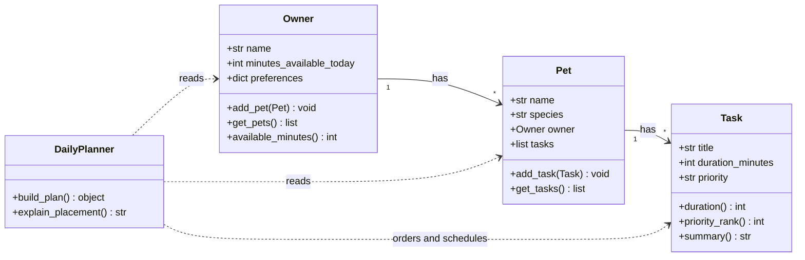

# PawPal+ Project Reflection

## 1. System Design

### Step 2: Building blocks (four main classes)

**Owner**

- **Attributes:** `name`; `minutes_available_today` (how many minutes the owner can spend on pet care today); optional `preferences` (e.g. preferred walk times or simple flags).
- **Methods:** `add_pet(pet)`; `pets()` / `get_pets()`; `available_minutes()` (read or update the time budget).

**Pet**

- **Attributes:** `name`; `species` (e.g. dog, cat, other); reference to owning **Owner**; a collection of **Task** objects for this planning session.
- **Methods:** `add_task(task)`; `tasks()` / `get_tasks()`; optionally `remove_task(task)` for the UI.

**Task**

- **Attributes:** `title`; `duration_minutes`; `priority` (e.g. low / medium / high, matching the Streamlit inputs in `app.py`).
- **Methods:** `duration()` (accessor); `priority_rank()` (numeric rank for sorting); `__repr__` or `summary()` for display.

**DailyPlanner**

- **Attributes:** none required if it is a **stateless** service; optional `day_start` / slot size if you model a clock explicitly later.
- **Methods:** `build_plan(owner, pet, tasks)` → returns an ordered plan (and per-item explanations); `explain_placement(task, context)` for the “why this task here” strings.

Together, this gives: **Owner has many Pets**, **Pet has many Tasks**, and **DailyPlanner** uses Owner + Pet + Tasks to produce the day’s schedule and reasoning.

### Step 3: UML (Mermaid class diagram)

I used Cursor (instead of Copilot in VS Code) with the same idea: describe a **pet care app** with **four classes** and the brainstorm above, then generate a **Mermaid** class diagram. Mermaid is text-based; you can preview it in Cursor’s Markdown preview or paste it into the [Mermaid Live Editor](https://mermaid.live).

**Review:** The relationships match the domain: **Owner has Pets**, **Pet has Tasks**, and **DailyPlanner** depends on all three without owning them. I avoided extra classes (e.g. a separate `DailyPlan` type) here to keep the diagram to four classes as assigned; the return type of `build_plan` can be a list of structured entries in code.

**a. Initial design**

I chose four classes so the domain stays clear: **who** (owner and pet), **what work exists** (tasks), and **how a day is built** (planner). Responsibilities:

- **Owner** — Stores identity and scheduling inputs: name, how many minutes are available today, and optional preferences. It owns the list of **Pet** objects for this app (`add_pet` / `get_pets`) and exposes `available_minutes()` so the planner can respect the time budget.
- **Pet** — Stores the animal's name and species and holds the **Task** backlog for the current session (`add_task` / `get_tasks`). It can point back to its **Owner** so explanations and UI stay consistent.
- **Task** — One unit of care work: title, duration, priority. Helper methods (`duration`, `priority_rank`, `summary`) support sorting and display without putting all display logic in the UI.
- **DailyPlanner** — Stateless service that reads an **Owner**, a **Pet**, and a task list, then will produce a plan plus reasons (`build_plan`, `explain_placement`). It does not own pets or tasks; it depends on them (as in the UML dependency arrows).

Structurally, this separates **data** (Owner → Pet → Task) from **behavior** (planning in **DailyPlanner**). The Mermaid diagram in Step 3 matches this split.

**b. Design changes**

**Planned model tweak (output shape):** I still expect to add something like **ScheduledItem** / **PlanEntry** (task + start time or slot + explanation) once the scheduler is real, because a backlog **Task** is not the same as a placed item on the timeline. That is separate from the four-class UML, which stays the core blueprint.

**Refinements after reviewing `pawpal_system.py` (Step 5):** I had an AI assistant review the skeleton and applied small fixes so relationships and accessors match the UML intent:

- **Bidirectional Owner ↔ Pet:** Empty `add_pet` stubs risked an owner's list and a pet's `owner` field getting out of sync. `add_pet` now appends the pet to the owner and sets `pet.owner = self`.
- **Pet ↔ Task:** `add_task` / `get_tasks` now append and return the pet's task list instead of no-ops, so the backlog is usable from code and tests.
- **Getter stubs:** `get_pets`, `get_tasks`, and `available_minutes` used to fall through with `pass` and would have returned `None` by mistake; they now return the underlying values.
- **Task helpers:** `duration`, `priority_rank`, and `summary` are implemented with simple rules so sorting and UI strings work; unknown priority strings default to a middle rank.
- **Potential bottleneck (documented, not a bug):** `build_plan(owner, pet, tasks)` takes both `pet` and a separate `tasks` list. That could duplicate `pet.tasks` if callers are careless. The class docstring notes that callers should pass the same tasks they associate with the pet (e.g. `pet.get_tasks()`) until we refactor to a single source of truth.
- **Scheduling still TODO:** `DailyPlanner.build_plan` and `explain_placement` remain unimplemented on purpose until the scheduling phase.

Implementation in `app.py` is still the starter shell; wiring the UI to these classes is the next step.

---

## 2. Scheduling Logic and Tradeoffs

**a. Constraints and priorities**

- What constraints does your scheduler consider (for example: time, priority, preferences)?
- How did you decide which constraints mattered most?

**b. Tradeoffs**

- Describe one tradeoff your scheduler makes.
- Why is that tradeoff reasonable for this scenario?

---

## 3. AI Collaboration

**a. How you used AI**

- How did you use AI tools during this project (for example: design brainstorming, debugging, refactoring)?
- What kinds of prompts or questions were most helpful?

**b. Judgment and verification**

- Describe one moment where you did not accept an AI suggestion as-is.
- How did you evaluate or verify what the AI suggested?

---

## 4. Testing and Verification

**a. What you tested**

- What behaviors did you test?
- Why were these tests important?

**b. Confidence**

- How confident are you that your scheduler works correctly?
- What edge cases would you test next if you had more time?

---

## 5. Reflection

**a. What went well**

- What part of this project are you most satisfied with?

**b. What you would improve**

- If you had another iteration, what would you improve or redesign?

**c. Key takeaway**

- What is one important thing you learned about designing systems or working with AI on this project?
